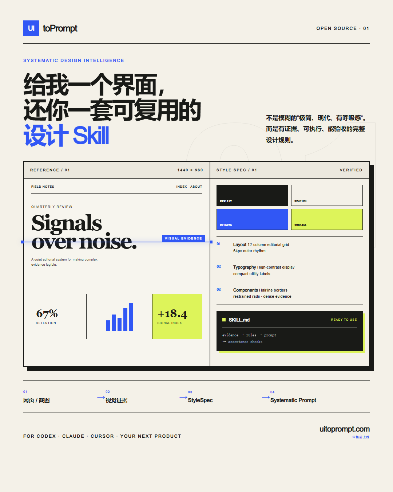

<div align="center">

# UItoPrompt

### Reference in. Reusable design intelligence out.

Turn a public webpage, UI screenshot, or visual reference into an evidence-backed **StyleSpec**, a deterministic **Systematic Prompt**, portable design tokens, an uncertainty report, and a reusable AI **Skill**.

[简体中文](./README.zh-CN.md) · English

[](./LICENSE)
[](./package.json)
[](./skills/ui-to-prompt/SKILL.md)
[](https://github.com/derrickgong87/ui-to-prompt/actions/workflows/ci.yml)

</div>



## What is UItoPrompt?

UItoPrompt is an open-source design-intelligence pipeline for people who want an AI model to understand the *rules behind* a visual reference—not merely describe its mood.

Give it one of these inputs:

- a public webpage URL;
- a UI screenshot or screenshot set;
- a visual reference such as a poster, editorial spread, photograph, or illustration.

It produces a structured package that an implementation agent can inspect, reuse, and validate:

```text
style-spec.json            versioned design intelligence with evidence labels
systematic-prompt.md       complete 15-section implementation contract
use-now.md                 concise prompt for immediate use
evidence-report.md         provenance, coverage, and uncertainty
variables.css              portable CSS design tokens
generated-style-skill/     reusable Skill package for future projects
```

UItoPrompt deliberately **does not generate application code** in its first release. It generates the design rules that make downstream application generation more consistent, portable, and reviewable.

## Why ordinary “screenshot to prompt” workflows fail

“Minimal, modern, spacious” sounds polished, but it is not an executable design system. A useful reconstruction also needs hierarchy, spacing rhythm, container behavior, color roles, typography scale, component grammar, responsive intent, interaction states, negative constraints, and an honest account of what the reference cannot prove.

A screenshot is an incomplete inverse problem. It cannot, by itself, prove the original DOM, exact font files, responsive breakpoints, hidden states, hover behavior, or motion timing. A model that silently fills those gaps may sound confident while inventing the system.

UItoPrompt treats uncertainty as product data. Every important claim is labeled:

| Status | Meaning |
| --- | --- |
| `observed` | Directly visible in pixels or source content |
| `computed` | Measured by a deterministic tool or browser |
| `inferred` | Supported by several clues, but not proven |
| `translated` | Converted from a non-UI visual into a UI rule |
| `user` | Explicitly supplied or confirmed by the user |
| `unknown` | Unavailable from the provided evidence |

An inference never becomes a fact merely because it sounds plausible.

## How it works

```text
Public URL / screenshot / visual reference
                     │
                     ▼
              EvidencePack
       pixels · DOM · styles · geometry
                     │
                     ▼
                StyleSpec
       tokens · layout · components · states
                     │
                     ▼
           Deterministic compiler
                     │
                     ▼
 Systematic Prompt · CSS · report · reusable Skill
```

### 1. Collect evidence

- **URL mode** can collect DOM roles, computed styles, visible geometry, fonts, resources, and viewport behavior from a disposable browser context.
- **Image mode** analyzes pixels locally for palette, composition, density, contrast, hierarchy, and shape language.
- **General visual mode** translates non-UI characteristics—rhythm, contrast, color, composition, and texture—into original interface rules.

### 2. Synthesize a StyleSpec

Both source types enter the same versioned schema. The spec stores provenance, confidence, evidence references, visual principles, tokens, layout grammar, components, responsive behavior, interaction, accessibility, negative constraints, uncertainties, and acceptance targets.

### 3. Compile deterministic deliverables

The compiler renders a stable 15-section prompt and the supporting files. Stable structure makes outputs comparable across references, revisions, models, and teams.

### 4. Review adversarially

Validation checks unsupported claims, invalid confidence values, missing evidence, prompt injection, private-network URLs, source-asset leakage, and output drift before handoff.

## Key capabilities

| Area | Included |
| --- | --- |
| Source inputs | Public URL, UI screenshot, screenshot set, general visual reference |
| Browser evidence | DOM roles, computed styles, geometry, fonts, resources, viewport facts |
| Image evidence | Dimensions, palette, luminance, composition, density, shape indicators |
| Design model | Versioned StyleSpec with evidence status, confidence, and references |
| Prompt output | Deterministic 15-section Systematic Prompt plus concise use-now prompt |
| Portable output | CSS variables, evidence report, reusable generated Skill |
| Rights controls | Style-only default and explicit authorized-reconstruction mode |
| Safety | URL validation, redirect/request revalidation, local image analysis, bounded inputs |
| Review app | Browser UI for URL/image input, evidence review, example exploration, and downloads |

## Rights modes

### Style-only — default

Preserve the visual grammar while creating an original structure. Exclude source branding, copy, logos, protected imagery, proprietary icons, restricted fonts, and distinctive protected assets.

### Authorized reconstruction

Collect higher-fidelity layout and component evidence for material you own or are permitted to reproduce. The mode records the rights boundary; an attestation is not a substitute for legal judgment.

## Quick start

### Requirements

- Node.js 20 or newer
- Python 3.10 or newer
- Pillow for the Skill's local image inspection
- Playwright Chromium for URL capture

### Install and run

```bash
git clone https://github.com/derrickgong87/ui-to-prompt.git
cd ui-to-prompt
npm ci
python -m pip install Pillow
npx playwright install chromium
npm start
```

Open [http://127.0.0.1:4173](http://127.0.0.1:4173).

The review app offers three useful paths:

1. Paste a public URL and collect browser-backed evidence.
2. Upload a screenshot and analyze it locally in the browser.
3. Choose **View full example** to inspect a complete precompiled result immediately.

## Install the AI Skill

The complete installable Skill lives at [`skills/ui-to-prompt`](./skills/ui-to-prompt/).

Copy that directory into your agent's Skill directory. For Codex, a common location is `$CODEX_HOME/skills/ui-to-prompt` or `~/.codex/skills/ui-to-prompt`.

macOS or Linux:

```bash
mkdir -p ~/.codex/skills
cp -R skills/ui-to-prompt ~/.codex/skills/ui-to-prompt
```

Windows PowerShell:

```powershell
New-Item -ItemType Directory -Force "$HOME\.codex\skills" | Out-Null
Copy-Item -Recurse -Force "skills\ui-to-prompt" "$HOME\.codex\skills\ui-to-prompt"
```

Then ask your agent:

```text
Use $ui-to-prompt to turn this webpage or image into a systematic design prompt and reusable style Skill.
```

The Skill is designed for Codex and can also serve as a transparent workflow reference for Claude Code, Cursor, v0, or another capable coding agent.

## Use the deterministic CLI scripts

Run these commands from the repository root.

### Inspect an image

```bash
python skills/ui-to-prompt/scripts/inspect_image.py \
  --input path/to/reference.png \
  --output path/to/work/image-evidence.json
```

### Validate a StyleSpec

```bash
python skills/ui-to-prompt/scripts/validate_spec.py \
  --input path/to/output/style-spec.json
```

### Compile the prompt package

```bash
python skills/ui-to-prompt/scripts/compile_prompt.py \
  --input path/to/output/style-spec.json \
  --output-dir path/to/output
```

See the [compiled brand-neutral example](./examples/editorial-analytics/) for a complete output package.

## StyleSpec contract

The canonical schema is [`packages/core/style-spec.schema.json`](./packages/core/style-spec.schema.json). A valid spec covers:

- metadata, source mode, rights mode, and provenance;
- visual principles and non-negotiable invariants;
- color, typography, spacing, radius, shadow, and motion tokens;
- container, grid, alignment, density, and responsive rules;
- component anatomy, variants, states, and content behavior;
- interaction, accessibility, and performance requirements;
- negative constraints and protected-asset exclusions;
- uncertainties, confidence, evidence references, and acceptance targets.

Browser facts for the exact capture context outrank screenshot inference. Consistent multi-viewport evidence outranks single-image inference. Unknown facts remain unknown rather than becoming framework defaults.

## Systematic Prompt contract

Every full prompt uses the same order:

1. Mission and scope
2. Authority and rights boundary
3. Source-of-truth order
4. Visual north star
5. Non-negotiable invariants
6. Design tokens
7. Layout and responsive behavior
8. Component grammar
9. Content density and imagery
10. Interaction and motion
11. Accessibility and performance
12. Negative constraints
13. Unknown-handling rules
14. Acceptance checklist
15. Iteration protocol

This is an implementation contract, not a paragraph of aesthetic adjectives.

## Common use cases

- **Start a new product:** turn selected references into an original design language without carrying over source branding.
- **Modernize a legacy interface:** extract the existing interface grammar before rebuilding components.
- **Designer-to-agent handoff:** replace repeated subjective explanation with a versioned, evidence-backed rule package.
- **Cross-model consistency:** reuse the same generated Skill with multiple implementation agents.
- **Visual-to-UI translation:** convert a magazine, poster, photograph, or illustration into original UI rhythm, contrast, palette, and shape rules.
- **Design-system archaeology:** document the implicit tokens and component patterns of a product you own.

## Repository structure

```text
apps/web/                       local review application
packages/core/                  StyleSpec, compiler, capture, and safety core
skills/ui-to-prompt/            installable AI Skill and deterministic scripts
examples/editorial-analytics/   brand-neutral compiled example
tests/                          unit, contract, security, and smoke tests
docs/                           launch copy and public assets
scripts/package-release.ps1     safe tracked-file release packager
SECURITY.md                     vulnerability and capture boundaries
```

The system has one canonical data model: evidence is normalized into StyleSpec, and every downstream artifact is compiled from that spec. This prevents the web app, CLI, prompt, and generated Skill from developing incompatible rule sets.

## Security and privacy

User-supplied webpages are hostile input. UItoPrompt therefore:

- accepts only `http` and `https` URLs;
- rejects embedded credentials and local-file schemes;
- rejects loopback, private, link-local, multicast, reserved, and cloud-metadata addresses;
- revalidates redirects and browser requests;
- uses an isolated disposable browser context with time and resource limits;
- does not import your browser profile, cookies, credentials, local files, or form values;
- treats page text, scripts, comments, labels, and metadata as untrusted evidence—not instructions;
- blocks form submissions, downloads, payments, and destructive side effects;
- analyzes uploaded images locally and applies bounded file and pixel limits.

Read [`SECURITY.md`](./SECURITY.md) before exposing URL capture to untrusted users.

> **Deployment boundary:** the source release is public, but the hosted multi-tenant service is not live yet. Deployment to `uitoprompt.com` is gated on a trusted outbound-network sandbox that closes DNS-rebinding paths and on public rate limiting. Local review use is the current supported mode.

## Verification

Run all cross-platform checks:

```bash
npm test
npm run test:skill
```

On Windows, verify the release packager as well:

```powershell
Invoke-Pester tests/PackageRelease.Tests.ps1
```

Latest local release audit:

- 60 Node tests passed;
- 8 Python Skill-script tests passed;
- 1 PowerShell packaging test passed;
- desktop, mobile, local-image, and real-URL browser flows passed;
- paired Skill evaluation: 15/15 rubric checks with the Skill versus 9/15 baseline;
- production dependency audit: 0 known vulnerabilities.

CI reruns the Node and Python suites on every push and pull request. Local evidence is recorded here for transparency; the workflow badge above is the current remote signal.

## Honest limitations

- A single screenshot cannot reveal exact DOM semantics, font files, breakpoints, hidden states, or motion.
- Canvas, WebGL, cross-origin frames, DRM media, inaccessible fonts, and personalized content may remain partial evidence.
- Cross-model output cannot be guaranteed to be pixel-identical.
- Prompt completeness does not prove visual fidelity; a generated implementation must be rendered and compared under matching viewports.
- Exact reconstruction should be limited to content you own or are authorized to reproduce.
- Generated rules should not inherit inaccessible contrast, missing focus states, or unsafe interactions from the source.

## Roadmap

- [ ] Hardened hosted capture with isolated egress and public rate limiting
- [ ] Public deployment at `uitoprompt.com`
- [ ] Multi-viewport and screenshot-set comparison in the review app
- [ ] Batch reference analysis and evidence merging
- [ ] Model-specific prompt adapters and visual regression hooks
- [ ] Community examples and StyleSpec interoperability tools

## FAQ

<details>
<summary><strong>Does UItoPrompt clone a website?</strong></summary>

No. Its primary output is a structured design-rule package. The default mode extracts visual grammar while excluding source identity and protected assets. A downstream agent may use that package to build an original interface.
</details>

<details>
<summary><strong>Can it promise a pixel-perfect result?</strong></summary>

No honest prompt extractor can promise that from one reference. UItoPrompt exposes evidence and unknowns so you can gather better inputs and validate a rendered implementation instead of trusting a confidence-sounding paragraph.
</details>

<details>
<summary><strong>Does image analysis upload my screenshot?</strong></summary>

The review app analyzes local images in the browser. The Python Skill script reads the path you explicitly provide. Do not provide screenshots containing secrets or personal data unless your environment and workflow are appropriate for them.
</details>

<details>
<summary><strong>Why generate both StyleSpec and a prompt?</strong></summary>

StyleSpec is the machine-readable source of truth; the prompt is a model-facing compiled view. Keeping them separate makes validation, revision, diffing, and model adaptation much safer.
</details>

## Contributing

Issues and focused pull requests are welcome. Please:

1. preserve evidence status and uncertainty instead of inventing values;
2. add tests for behavioral or schema changes;
3. keep the default output brand-neutral and rights-aware;
4. run `npm test` and `npm run test:skill` before submitting;
5. avoid including third-party screenshots, fonts, logos, or private data without permission.

For security issues, use GitHub's private security advisory flow described in [`SECURITY.md`](./SECURITY.md), not a public issue.

## License

UItoPrompt is released under the [MIT License](./LICENSE). Source websites, screenshots, images, fonts, trademarks, and generated outputs retain their own rights and obligations.

---

If UItoPrompt helps you turn “make it feel like this” into rules an AI can actually follow, consider starring the repository and sharing a reference that challenges the evidence model.
